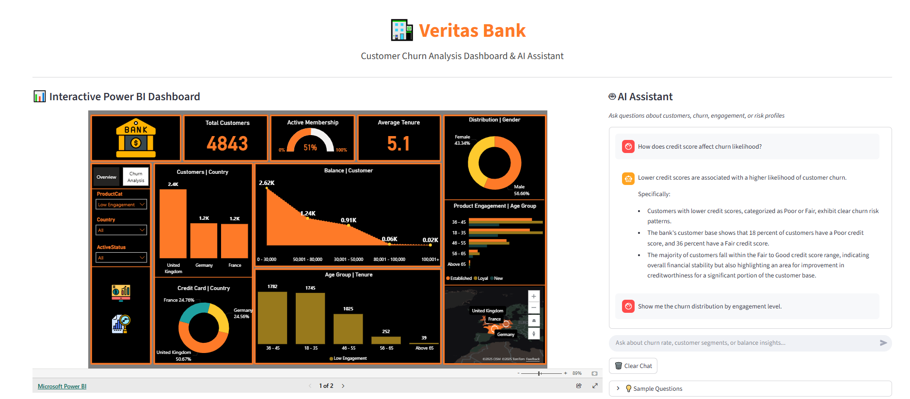
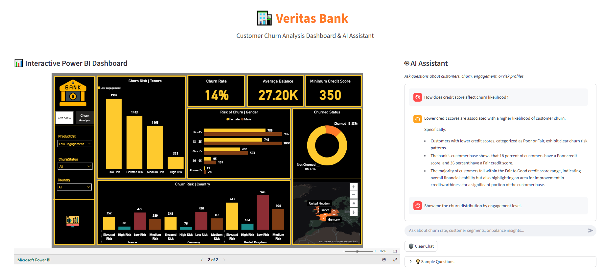

# 🏦 Veritas Bank – Customer Churn Analytics & Power BI Intelligence Assistant

### 💡 Overview
A data-driven banking analytics project integrating **Data Science** and **Business Intelligence (BI)** to predict customer churn, analyze creditworthiness, and enhance retention strategies through an **AI-powered Power BI assistant**.

---

---
## 🚀 Goals
- Analyze customer demographics, account behavior, and churn trends.  
- Build interactive Power BI dashboards for management insights.  
- Enable natural-language Q&A using an AI-powered chatbot.  
- Combine predictive analytics with BI reporting for decision-making.

---

## 🧩 Dataset Summary
- **Customer Information:** ID, gender, age, country, tenure, balance, products held, and credit card ownership.  
- **Account Details:** Credit score, estimated salary, active member status, and churn label (Exited/Retained).  

---

## 📊 Key Insights
- **Total Customers:** 10,000 | **Exited Customers:** 1,390 | **Churn Rate:** 13.9%  
- **Average Credit Score:** 651 | **Average Balance:** £27,154  
- **Active Members:** 52% | **Inactive:** 48%  
- **Average Tenure:** 5 years | **Average Age:** 39 years  
- **Top Countries:** United Kingdom, France, Germany  
- **High-Risk Segment:** Customers with low tenure and credit score below 600  

---

## 🧠 Data Science + BI Strategy
| Data Science | Business Intelligence |
|---------------|-----------------------|
| Data cleaning & EDA (Python, Pandas) | Power BI dashboards & KPIs |
| Churn prediction modeling | Visual retention dashboards |
| Feature engineering & correlation analysis | Management-level churn summaries |
| Insight automation via Gemini AI | AI chatbot for Q&A and reporting |

---

## 🧮 Core KPIs
- **Churn Rate:** Exited ÷ Total Customers  
- **Retention Rate:** Active ÷ Total Customers  
- **Average Credit Score:** SUM(CreditScore)/COUNT(Customers)  
- **Average Tenure:** SUM(Tenure)/COUNT(Customers)  
- **High-Risk Customers:** Customers with CreditScore < 600 and Exited = 1  

---

## 🤖 Chatbot Features
The AI chatbot answers:
- “What is the overall churn rate?”  
- “Which country has the highest churn?”  
- “What factors most influence customer exits?”  
- “How can Veritas Bank improve customer retention?”  
- “What is the average credit score by active status?”

---

## ⚙️ Tech Stack
**Data:** Python, Pandas, NumPy  
**Visualization:** Power BI, DAX, Power Query  
**AI:** Google Gemini (Generative AI)  
**Automation:** Streamlit + Gemini API Integration  

---

## 👨‍💻 Author
**Francis Afful Gyan**  
📧 [francisaffulgyan@gmail.com](mailto:francisaffulgyan@gmail.com)  
🔗 [LinkedIn](https://www.linkedin.com/in/francis-afful-gyan-2b27a5153/)  
📅 October 2025  
🌐 [Live Demo](https://bankchurnaz.streamlit.app/)  
📊 *Project Status: Active Development*

## Thank You

