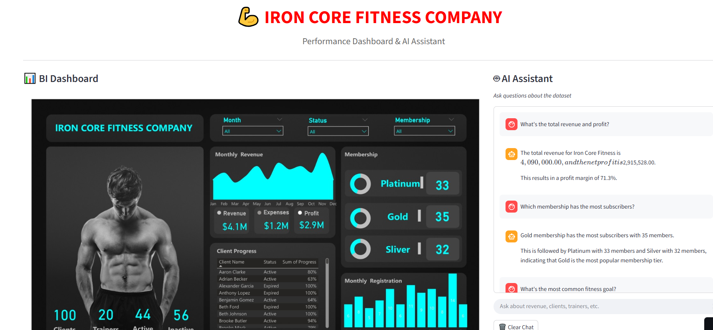

# 🏋️‍♂️ IronCore Fitness Analytics & Power BI Chatbot

### 💡 Overview
A data-driven fitness analytics project combining **Data Science** and **Business Intelligence (BI)** to optimize gym operations, track performance, and provide real-time insights through an **AI-powered Power BI chatbot**.

---

## 🚀 Goals
- Analyze member trends, trainer performance, and revenue patterns.  
- Build interactive Power BI dashboards.  
- Enable natural-language Q&A with a Power BI chatbot.  
- Integrate Data Science insights with BI reporting.

---

## 🧩 Dataset Summary
- **Users:** Demographics, membership, goals, and progress.  
- **Payments:** Transactions, payment modes, and dates.  
- **Expenses:** Operational costs (equipment, rent, salaries).

---

## 📊 Key Insights
- **Total Revenue:** \$4.1M | **Expenses:** \$1.2M | **Profit:** \$2.9M  
- **Most Popular Plan:** Gold (35%)  
- **Active Members:** 44% | **Inactive:** 56%  
- **Avg Age:** 32 years | **Avg Membership Duration:** 180 days  
- **Top Payment Mode:** Mobile Money  
- **Peak Revenue Months:** January, May, November  

---

## 🧠 Data Science + BI Strategy
| Data Science | Business Intelligence |
|---------------|-----------------------|
| Data cleaning & EDA (Python, Pandas) | Power BI dashboards & KPIs |
| KPI computation & trend modeling | Interactive visualizations |
| Insight automation | Chatbot integration |

---

## 🧮 Core KPIs
- **Profit Margin:** (Revenue - Expenses) / Revenue  
- **Active Clients %:** Active ÷ Total  
- **Avg Progress:** SUM(Progress)/COUNT(Clients)  
- **Client Retention:** Renewed ÷ Total  

---

## 🤖 Chatbot Features
The Power BI chatbot answers:
- “Which month had the highest revenue?”
- “Who are the top trainers?”
- “What’s our profit margin?”
- “How can retention improve?”

---

## ⚙️ Tech Stack
**Data:** Python, Pandas, NumPy  
**Visualization:** Power BI, DAX, Power Query  
**AI:** Power Virtual Agents  

---

## 👨‍💻 Author
**Francis Afful Gyan**  
📧 [francisaffulgyan@gmail.com](mailto:francisaffulgyan@gmail.com)  
🔗 [LinkedIn](https://www.linkedin.com/in/francis-afful-gyan-2b27a5153/)  
📅 October 2025  
🌐 [Live Demo](https://iron-core-fitness.streamlit.app/)  
📊 *Project Status: Active Development*

## Thank You

